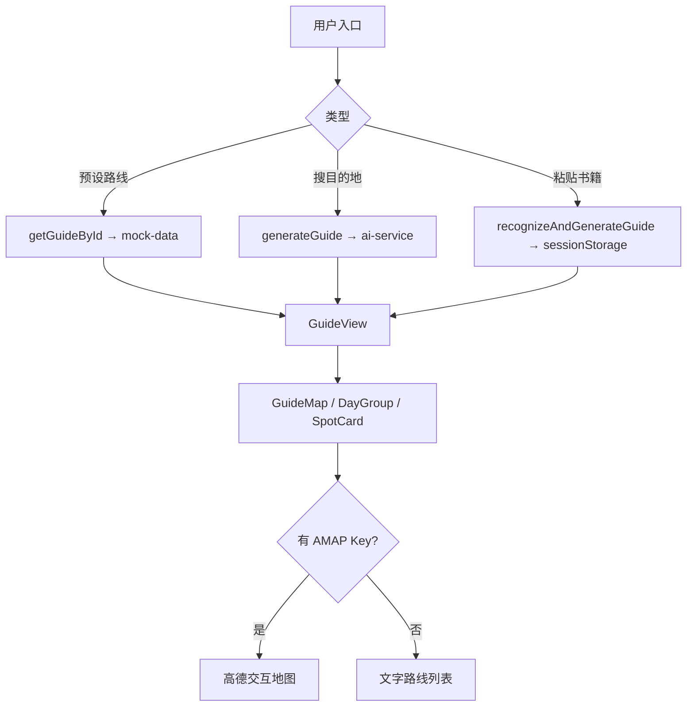

# 寻城 (journey-guide) 功能报告

**版本：** v0.1  
**日期：** 2026-07-08  
**项目：** IEIIC OPC 人工智能黑客松 · 智慧城市民生服务赛道  
**仓库：** https://github.com/chensiyu080131-alt/journey-guide

---

## 一、项目概述

| 项 | 内容 |
|---|---|
| **产品名称** | 寻城 |
| **定位** | AI 驱动的「跟着书本去旅行」文学旅行攻略平台 |
| **核心理念** | 选一本书、一个人、一座城 — 把文学原文与脚下实景连成可落地的旅行路线 |
| **Demo 城市** | 常熟（4 条完整文学路线，可面向文旅局直接落地） |
| **技术栈** | Next.js 14 · React 18 · TypeScript · Tailwind CSS · 高德地图 · OpenAI Next API |

---

## 二、功能模块总览

### 2.1 首页

| 模块 | 功能说明 |
|---|---|
| **Hero 区** | 全屏背景、品牌 Slogan、双 CTA（探索常熟路线 / 搜一座城） |
| **路线轮播** | 横向卡片轮播，支持筛选（全部 / 跟着书走 / 跟着人走），点击进入攻略页 |
| **套餐展示区** | 深色卡片网格展示常熟文学路线，含天数、标签、价格提示 |
| **特色三栏** | 原文对照 · 路线地图 · 在地美食 |
| **四步引导** | 选入口 → 读原文 → 看路线 → 出发 |
| **顶栏 / 页脚** | 全站导航、路线快捷入口、黑客松信息 |

### 2.2 三种旅行入口

| 入口 | 路径 | 说明 |
|---|---|---|
| **跟着书走** | `/guide/shajiabang/` 等 | 选一本书，进入预设文学路线 |
| **跟着人走** | `/guide/wengtonghe/` | 选一位历史人物，沿其足迹旅行 |
| **搜一座城** | `/guide/destination/` | 输入城市、天数、兴趣、预算，AI 生成攻略 |
| **粘贴书籍片段** | 首页底部 | AI 识别文字中的地点，自动生成路线 |

---

## 三、预设路线（常熟 Demo）

| 路线 | 入口类型 | 天数 | 主题 | 景点数 |
|---|---|---|---|---|
| **《沙家浜》** | 书籍 | 1 天 | 红色经典 · 芦苇荡 | 6 |
| **《孽海花》** | 书籍 | 2 天 | 晚清文人 · 曾朴 | 6 |
| **翁同龢** | 人物 | 1 天 | 两代帝师 | 6 |
| **钱柳乱世情缘** | 书籍 | 2 天 | 钱谦益与柳如是 | 8 |

每条路线包含：

- **按天 + 按时段** 的行程安排（上午 / 中午 / 下午 / 晚上）
- **原文对照**：书中原文 + 出处 + 实景说明（核心差异化功能）
- **方言速查**：5 条常熟方言及使用场景
- **在地体验**：3 项赶集 / 时令 / 民俗 / 手艺体验
- **旅行贴士**：4 条实用建议
- **路线地图**：高德地图标记 + 连线（有坐标时）

### 3.1 路线详情

#### 《沙家浜》— 1 天

春来茶馆 → 沙家浜芦苇荡 → 阳澄湖大闸蟹 → 横泾老街 → 革命历史纪念馆 → 叫花鸡

#### 《孽海花》— 2 天

曾园（虚廓园）→ 铁琴铜剑楼 → 蕈油面 → 虞山剑门 → 方塔 → 桂花酒酿圆子

#### 翁同龢 — 1 天

彩衣堂 → 读书台 → 蕈油面 → 翁墓 → 虞山城墙 → 叫花鸡

#### 钱柳乱世情缘 — 2 天

半野堂旧址 → 红豆山庄 → 尚湖风景区 → 铁琴铜剑楼 → 虞山钱柳墓 → 蕈油面 → 桂花酒酿圆子 → 碑刻博物馆

---

## 四、攻略详情页功能

| 功能 | 说明 |
|---|---|
| **加载动画** | 4 阶段文案 + 进度条，提升等待体验 |
| **Hero 封面** | 路线封面图、标题、天数 / 预算 / 价格标签 |
| **路线引言** | 文学背景与路线故事概述 |
| **互动地图** | 编号 Marker、方向 Polyline、自动 fitView；无 Key 时降级为文字列表 |
| **景点卡片** | 名称、类型、时长、预算、时段、拍照点、「现在适合去」标签 |
| **原文 ↔ 实景** | 点击展开 / 收起书中原文与实景对照 |
| **完成勋章** | 完成旅程后领取文化勋章（4 条路线各有专属勋章） |
| **分享** | 复制当前页面 URL |

---

## 五、AI 能力

| 能力 | 触发方式 | 实现 |
|---|---|---|
| **自定义目的地攻略** | 搜一座城 / 热门城市快捷入口 | `generateGuide()` → OpenAI Next API |
| **书籍片段识别** | 首页粘贴文字 | `recognizeAndGenerateGuide()` → 识别地点并生成 JSON 攻略 |
| **预设路线** | 点击路线卡片 | Mock 数据，不调用 LLM（保证 Demo 稳定） |

**AI 生成内容结构：** 标题、引言、按天行程、每个景点的原文 + 实景对照、方言、在地体验、贴士。

---

## 六、互动功能（已实现 UI）

| 类型 | 交互方式 |
|---|---|
| **诗词诵读** | 展示诗词 + 浏览器 TTS 朗读 |
| **知识问答** | 选择题 + 即时判分 |
| **古籍寻宝** | 对比原文与篡改版，找错字 |
| **书法临摹** | Canvas 临摹书法 |

> 注：互动任务组件已完整实现，Mock 数据中尚未配置具体任务，Demo 中暂不可见。

---

## 七、技术架构

```
用户入口
  ├─ 预设路线 → getGuideById() → mock-data（本地 Mock）
  ├─ 搜目的地 → generateGuide() → ai-service（客户端 LLM）
  └─ 粘贴书籍 → recognizeAndGenerateGuide() → sessionStorage → 攻略页
                    ↓
              GuideView
         ├─ GuideMap（高德地图）
         ├─ DayGroup（按天分组）
         └─ SpotCard（原文对照 + 互动任务）
```

### 7.1 页面 / 路由

| 路由 | 功能 |
|---|---|
| `/` | 首页 |
| `/guide/shajiabang/` | 《沙家浜》攻略 |
| `/guide/niehaifeng/` | 《孽海花》攻略 |
| `/guide/wengtonghe/` | 翁同龢攻略 |
| `/guide/qianliu/` | 钱柳乱世情缘攻略 |
| `/guide/destination/` | 自定义目的地 / AI 生成 |

### 7.2 主要组件

| 组件 | 用途 |
|---|---|
| `SiteHeader` / `SiteFooter` | 全站导航与页脚 |
| `EntryCards` | 路线轮播 + 筛选 + 搜索 + 书籍识别 |
| `RoutePackages` | 深色套餐区 |
| `HowItWorks` | 四步引导 |
| `GuideView` | 攻略主视图 |
| `GuideMap` | 高德地图 |
| `DayGroup` | 按天按时段分组 |
| `SpotCard` | 景点卡片 + 原文对照 |
| `InteractiveTask` | 四种互动任务 |

### 7.3 部署配置

| 配置项 | 值 |
|---|---|
| **部署模式** | 静态导出（`output: 'export'`） |
| **URL 格式** | `trailingSlash: true`（适配静态托管） |
| **本地开发** | `npm run dev` → http://localhost:3000 |
| **静态预览** | `npm run preview` → http://localhost:8080 |
| **环境变量** | `NEXT_PUBLIC_AMAP_KEY`（高德）；LLM Key 当前硬编码在 `ai-service.ts` |

---

## 八、已知限制与待完善项

| 类别 | 说明 |
|---|---|
| **静态部署** | 无服务端 API，LLM 在客户端直连 |
| **API Key** | 硬编码在代码中，存在泄露风险；`.env` 配置尚未接入 |
| **AI 生成地图** | AI 输出可能缺少经纬度，地图无法显示 |
| **互动任务** | UI 就绪，Mock 无数据 |
| **路线 AI 对话** | `chatAboutRoute()` 已实现但未接入 UI |
| **内容一致性** | 首页写「三条路线」，实际已有 4 条；Footer 缺少钱柳链接 |
| **移动端** | 小屏 Header 导航不完整 |

---

## 九、近期修复记录

| 日期 | 修复内容 |
|---|---|
| 2026-07-08 | 轮播卡片点击无效 → 改 `<Link>` 导航 |
| 2026-07-08 | 静态部署 404 → 启用 `trailingSlash` |
| 2026-07-08 | 新增钱柳路线、互动任务组件、完成勋章 |
| 2026-07-08 | 构建错误修复（类型定义、package.json、LLM 导出） |

---

## 十、总结

寻城 v0.1 是一个面向黑客松 Demo 的**文学旅行静态 Web 应用**，核心亮点：

1. **原文对照** — 书中写的，就是脚下走的（差异化功能）
2. **常熟 4 条完整路线** — 可落地、可路演、可对接文旅局
3. **AI 自定义生成** — 任意城市 / 书籍片段均可生成攻略
4. **高德地图集成** — 路线可视化，编号标记 + 方向连线
5. **Bromo 风格 UI** — 高端旅行网站视觉，适合路演展示

**适合场景：** 黑客松路演、常熟文旅局洽谈、Vercel / 静态托管快速部署。

---

## 附录：核心数据流


