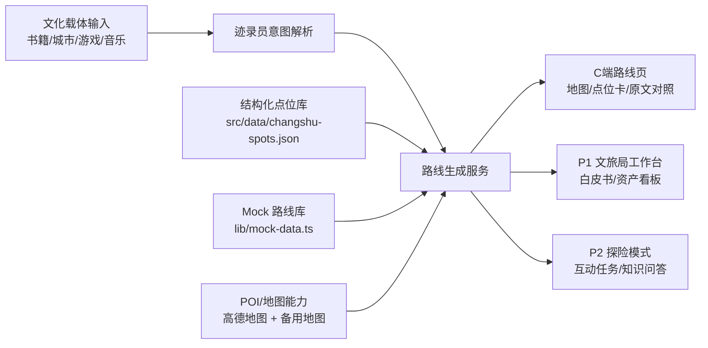
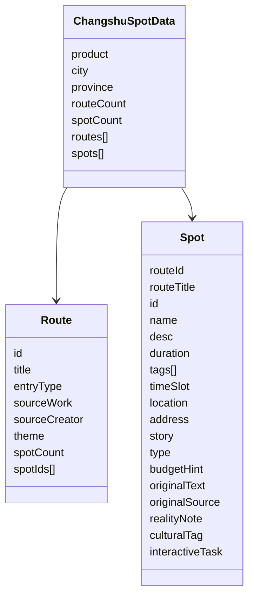
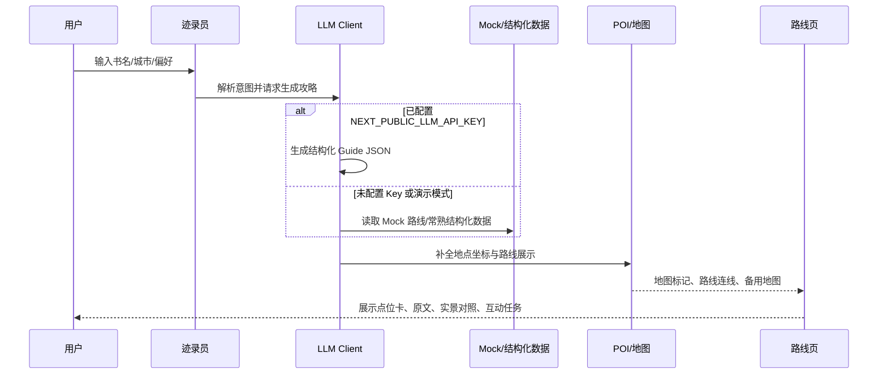
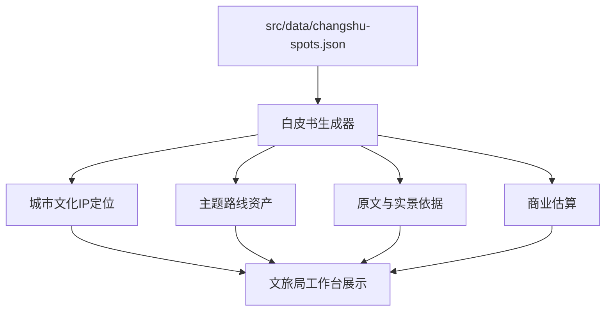
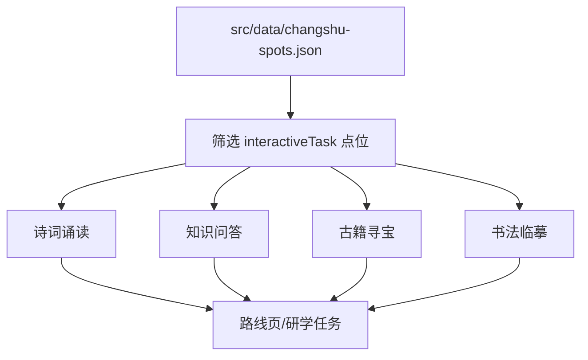

# 寻迹数据流图

> 目标：说明最新版寻迹如何从文化载体、结构化点位和用户输入出发，生成 C 端路线体验与 B 端文旅局白皮书。

## 1. 总览

## 2. 核心数据源

| 数据源 | 文件 | 作用 |
| --- | --- | --- |
| 常熟结构化点位 | `src/data/changshu-spots.json` | 4 条路线、26 个点位，供 P1/P2/地图路线复用 |
| 常熟 Demo 路线 | `lib/mock-data.ts` | 当前前台攻略页主要数据来源 |
| 《人间滋味》路线 | `lib/renjianziwei-guide.ts` | 汪曾祺/高邮/美食散文专题路线 |
| 城市扩展路线 | `lib/city-guides.ts`、`lib/national-city-guides.ts` | 南京、苏州、凤凰、上海等城市路线 |
| 首页文化载体 | `lib/home-covers.ts` | 书籍、城市、游戏、音乐等首页入口 |
| AI 人格/Mock 响应 | `lib/ai-personas.ts` | AI 书灵、文学侦探、白皮书等兜底内容 |

## 3. 常熟点位 JSON 结构

## 4. C 端路线生成流程

## 5. P1 文旅局白皮书复用路径

当前实现中，`components/dashboard/whitepaper-generator.tsx` 已在 Mock/无 Key 场景下读取 `src/data/changshu-spots.json`。输入“常熟”时，白皮书会展示真实的路线数量、点位数量、原文出处和互动任务数量。

## 6. P2 探险模式复用路径

常熟 JSON 中已保留 `interactiveTask` 字段，目前包括钱柳路线中的诗词诵读、古籍寻宝、知识问答、书法临摹等任务，可继续扩展成探险模式、研学任务卡或城市打卡任务。

## 7. 可信度控制

| 风险 | 控制方式 |
| --- | --- |
| AI 幻觉 | 原文出处、现实地点、人工审核三层校验 |
| 地点坐标不准确 | 优先结构化坐标，其次 POI 检索，失败时使用备用地图/文字路线 |
| 内容无法复用 | 将点位从页面 Mock 中抽离到 `src/data/changshu-spots.json` |
| B 端材料泛泛 | 白皮书读取真实点位和路线资产，再由 AI 扩写 |

## 8. 下一步数据工程计划

1. 将 `lib/mock-data.ts` 中常熟路线逐步改为读取 `src/data/changshu-spots.json`。
2. 为每个城市建立独立 JSON：`city-spots.json`、`city-routes.json`、`city-assets.json`。
3. 为点位增加 `verificationStatus`、`sourceUrl`、`lastReviewedAt` 字段，支持文旅局人工审核。
4. 为探险任务增加难度、耗时、适合年龄段和完成条件。
5. 建立统一的文化载体抽取格式，支撑书籍、音乐、游戏、影视的跨品类扩展。
